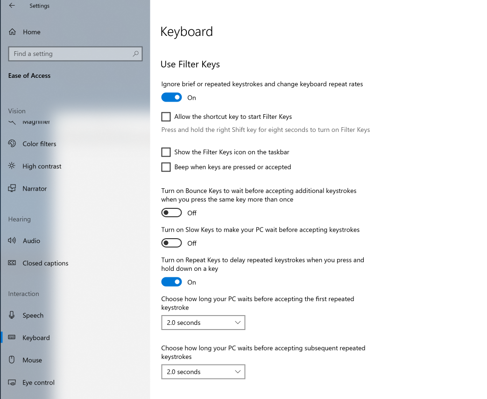

# Introduction

This crash course focuses on vim in VSCode.  Topics such as optimal `.vimrc` configurations or setting up vim in your shell to do auto-completion will not be covered.  VSCode provides an incredible development environment, and that paired with vim is a comprehensive solution for my purposes.  That's not to say I don't have [gripes](#vscode-vim-problems).

The other focus of this course is assume no prior knowledge of vim.  While that is true, I do have a way to make thise course challenging for medium to advanced users as well.

## Getting started

* Install vim in VSCode: https://marketplace.visualstudio.com/items?itemName=vscodevim.vim
* In VSCode edit settings (cmd+, or ctrl+,) and search for "lineNumbers" then ensure the dropdown says "relative"
* Fork this [repo](https://aka.ms/vimcrashcourse): `git clone git@github.com:engineersamuel/vim-crash-course.git`
* For Advanced users follow these [instructions](./#advanced-users).
* TBD: Put together a screencast of the power of vim.

## The power of vim

To see a little bit of the magic you can do with vim see this 

## How to quit vim

If you haven't seen [how-to-exit-vim](https://github.com/hakluke/how-to-exit-vim) take a look.  I believe this site is more sarcastic humor than it is reality.

How you exit vim? `:q`, how do you force exist? `:q!`, it's that simple.  And in VSCode, you don't even need to do that, just `ctrl|cmd+w` or just close the editor tab.

## Understanding vim syntax

If you want to decifer any vim syntax on the net, you need to know the grammar.  While it can get more complicated when we are talking about commands and searching, to keep it basic, just remember this: `{operator}{count}{motion}`

Examples:
* `daw` translates to `{operator: delete}{count: a single}{motion: word}`
* `x` translates to `{operator: delete}{count: unused}{motion: unused}`
* `d5j` translates to `{operator: delete}{count: 5}{motion: down}`
* `4k` translates to `{operator: unused}{count: 4}{motion: up}`

## Moving around

## Challenges

The challenges are designed in an OpenHack style where each successive challenge builds on the previous ones.  Most each challenge has 

* [Challenge 00 - Hello World](./challenges/challenge00.md)
* [Challenge 01 - Motion and editing](./challenges/challenge01.md)
* [Challenge 02 - Moving around the screen](./challenges/challenge02.md)
* [Challenge 03 - Visual mode](./challenges/challenge03.md)
* [Challenge 04 - Moving and Selecting in brackets](./challenges/challenge04.md)
* [Challenge 05 - Find and Search](./challenges/challenge05.md)

## My productive mainstays

TBD

#### Advanced Users

For more advanced users, if you want a challenge while still doing the intro content do the following:
* For Windows see:



* Mac, by default disables repeated keys, however if you have already re-enabled them do the following:
```
$ defaults write com.microsoft.VSCode ApplePressAndHoldEnabled -bool false         # For VS Code
$ defaults write com.microsoft.VSCodeInsiders ApplePressAndHoldEnabled -bool false # For VS Code Insider
```


#### VSCode Vim problems

* Key latency and performance.  I've encountered instances where I can type significantly faster than VSCode can handle the input creating a very annoying situation where I have to continually `u` and retype what I want since my vim commands were lagging.  Many times restarting VSCode completely helps, or my computer.  From what I've read on the VSCode github issues section this is largely due to vim commands going through an emulation layer instead of being natively handled by the underlying vim package like how Sublime handles it.
